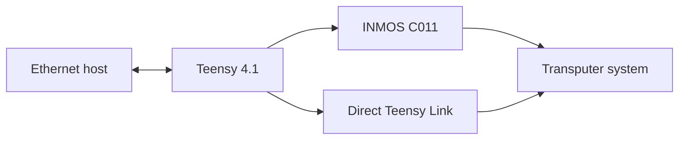

# Transputer Teensy Link

A family of practical, Ethernet-connected link interfaces for classic INMOS transputer systems, based on the Teensy 4.1.

The project provides three hardware variants, a common firmware platform, and compatibility with host tools using the INMOS B300/TCPlink protocol.

> **Project status:** All three interfaces are in active use. They are experimental retrocomputing hardware and may still contain minor hardware or firmware quirks. Enclosures have not yet been designed.

## Why transputers are still interesting in 2026

Transputers remain fascinating devices even in 2026.

They combine a processor, local memory, hardware-assisted process scheduling, and fast point-to-point communication links. A transputer was intended to be used as a building block in a larger network of cooperating processors rather than as the single centre of a computer.

Together with occam and its CSP-inspired programming model, transputers provide a very direct platform for studying:

- concurrent and parallel programming;
- message passing;
- distributed systems;
- deterministic communication;
- hardware-supported process scheduling;
- processor networks without a shared system bus.

Many of these ideas are still relevant in modern many-core processors, network-on-chip architectures, distributed services, and accelerator systems.

The difficult part today is often not finding an interesting transputer board. The practical problem is finding a convenient interface between a modern computer and the transputer link.

## Design goals

A useful modern transputer link interface should ideally be:

- **Fast** — supporting the maximum 20 Mbit/s link speed.
- **Standards-based** — using a documented and already supported host interface.
- **Galvanically isolated** — at least between the development computer and the adapter.
- **Cross-platform** — usable from Linux, macOS, Windows, and other systems.
- **Based on available components** — without requiring rare historical devices such as the INMOS C011.
- **Practical** — compact, robust, and easy to connect to different target systems.

The use of Ethernet provides a standard host connection and, with normal Ethernet magnetics, galvanic isolation between the host network and the adapter.

The current transputer-side interfaces are single-ended and share their electrical reference with the target system. Full galvanic isolation of the transputer link itself is therefore a possible future improvement rather than a feature of the current boards.

## Project history

Andre Saischowa created the first prototype using a Teensy 4.1 together with an INMOS C011 link adapter.

The article [Putting A Teensy To Task As A Transputer Link](https://hackaday.com/2025/10/20/putting-a-teensy-to-task-as-a-transputer-link/) described how the Teensy 4.1 UART can implement the unusual transputer link framing directly. This led to a substantial extension of the firmware and made it possible to operate a transputer link without a C011.

Karsten Schmidt, DG1VS, designed the printed circuit boards. Andre is the author and maintainer of the Teensy Link software and continued to develop and improve the firmware.

The result is a common software platform supporting both the traditional C011 approach and direct Teensy-to-transputer communication.

## System overview


The firmware obtains its IP address using DHCP and provides a B300-compatible service on TCP port **4047**.

The current firmware also contains:

- a small status web server on TCP port **80**;
- a network throughput test service on TCP port **4040**;
- optional SSD1306 OLED status output;
- experimental USB host, USB MIDI, and link-audio functions.

The additional USB and audio functions are not required for normal B300 link operation.

## Hardware variants

The KiCad hardware projects are located below [`hardware/`](hardware/).

### A. `link_teensy` — C011 and direct Teensy Link

Directory: [`hardware/link_teensy/`](hardware/link_teensy/)

This is the most complete board and contains both:

- a traditional INMOS C011 link interface;
- a direct Teensy 4.1 transputer link interface.



This board is useful as:

- the original development platform;
- a C011 reference implementation;
- a comparison between C011 and direct UART-based link handling;
- a flexible laboratory interface.

The main disadvantage of the C011 path is its dependency on a historical component that is increasingly difficult to obtain.

### B. `link_teensy_small` — compact direct link

Directory: [`hardware/link_teensy_small/`](hardware/link_teensy_small/)

This is a smaller board that connects the Teensy 4.1 directly to the transputer link without requiring a C011.


This is currently the most frequently used interface.

Its advantages include:

- no historical link-adapter IC;
- fewer components;
- compact construction;
- direct 20 Mbit/s operation;
- a 10-pin target connector carrying the link and subsystem control signals.

The target connector includes:

- `LinkIn`
- `LinkOut`
- `notReset`
- `notAnalyse`
- `notError`
- supply and ground connections

Always verify the exact connector orientation and board revision before connecting a target.

### C. `link_teensy_fpga` — direct link with PMOD adapter

Directory: [`hardware/link_teensy_fpga/`](hardware/link_teensy_fpga/)

This version is derived from the compact direct-link design and adds a 12-pin PMOD-style connector.

It is currently used while developing the [Transputer Picoputer](https://github.com/dg1vs/Transputer-Picoputer).


The PMOD mapping documented in the schematic is:

| Transputer signal | PMOD pin | Transputer signal | PMOD pin |
|---|---:|---|---:|
| `LinkIn` | 1 | `LinkOut` | 7 |
| `notAnalyse` | 2 | `notReset` | 8 |
| — | 3 | `notError` | 9 |
| — | 4 | — | 10 |
| GND | 5 | GND | 11 |
| 3.3 V | 6 | 3.3 V | 12 |

This variant is intended for development systems that expose their transputer-style link through a PMOD-compatible connector.

## How the direct Teensy Link works

The INMOS transputer link protocol resembles asynchronous serial communication, but it is not a conventional UART protocol.

Two token types are used:

- an **11-bit data token** carrying one byte;
- a very short **2-bit acknowledgement token**.

The Teensy 4.1 UART provides two features that make a direct implementation possible:

- inverted transmit and receive operation;
- 9-bit UART data mode.

The additional UART bit is used to reproduce the special transputer data-token framing. Incoming words are decoded as either data or acknowledgements, and the firmware implements the required link-level handshake and buffering.

The current direct-link implementation supports:

- **5 Mbit/s** as an available code path;
- **20 Mbit/s** as the normal and default operating mode.

The firmware deliberately rejects **10 Mbit/s** and recommends 20 Mbit/s. At the maximum speed, a timing corner case involving the emulated acknowledgement and a very fast response to operations such as `PEEK` is avoided.

The direct-link implementation currently uses:

| Function | Teensy 4.1 resource |
|---|---|
| Link UART | `Serial7` |
| Receive | pin 28 |
| Transmit | pin 29 |
| Target reset | pin 30 |
| Target analyse | pin 31 |
| Target error | pin 32 |

These assignments are defined in [`firmware/teensy_audiomidi_c011/tplinkconf.h`](firmware/teensy_audiomidi_c011/tplinkconf.h).

## B300 compatibility

The original INMOS IMS B300 TCPlink system provided network access to transputer links over Ethernet and TCP/IP.

This project implements the relevant **Linkops** service used by B300-compatible host drivers. The implemented operations include:

- open and close link;
- write and read link data;
- reset;
- analyse;
- test error.

The firmware identifies the service as:

```text
inmos.com(tcplink-linkops-01.00)
```

The B300-compatible server listens on the standard TCP port:

```text
4047
```

Technical documentation for the original system is available from transputer.net:

- [IMS B300 TCPlink Development System](https://www.transputer.net/mg/300/1857.pdf)
- [transputer.net documentation archive](https://www.transputer.net/)

## Host software

Modern builds of classic transputer host tools and the `link300` driver are provided by Michael through transputer.net:

- [bin.transputer.net](https://bin.transputer.net/)
- [binary archive](https://bin.transputer.net/bin2/)

Michael is the owner and maintainer of the tools distributed through transputer.net. These host tools are separate from the Teensy Link firmware in this repository.

Packages are available for several systems and architectures, including:

- Linux: x86, x86-64, ARM, AArch64, MIPS, and PowerPC;
- macOS: Intel x86-64 and Apple Silicon ARM64;
- Windows: x86, x86-64, ARM, and ARM64;
- DOS and several other historical operating systems.

Depending on the platform, the archive contains tools such as:

- `iserver`
- `afserver`
- `linktest`
- `peek`
- `poke`
- `rspy`
- `analyse`
- the `link300` library or DLL

The [`software/`](software/) directory contains project notes. For current binaries, use the transputer.net archive directly and observe its licensing and redistribution conditions.

## Firmware

The main firmware is located in:

[`firmware/teensy_audiomidi_c011/`](firmware/teensy_audiomidi_c011/)

A separate pin-test sketch is located in:

[`firmware/teensy_pin_test/`](firmware/teensy_pin_test/)

### Current default configuration

The checked-in [`tplinkconf.h`](firmware/teensy_audiomidi_c011/tplinkconf.h) currently enables:

- direct Teensy Link;
- Ethernet and B300 service;
- USB host support;
- USB MIDI client support;
- a 128 × 64 SSD1306 OLED at I²C address `0x3c`.

The C011 backend is present but disabled in the default configuration.

### Selecting the link backend

For the direct Teensy Link:

```cpp
//#define MIT_LINK_C011
#define MIT_LINK_TEENSY
```

For the C011 backend, enable `MIT_LINK_C011` and configure the other options according to the connected hardware.

The firmware can contain both backends, but their exact routing behaviour depends on the selected compile-time options. Review `tplinkconf.h` before building.

## Building the firmware

The firmware is intended for a **Teensy 4.1** using the Arduino IDE with Teensy support.

### Requirements

Install the following:

- Arduino IDE;
- Teensy board support / Teensyduino;
- `NativeEthernet`;
- `LibPrintf`;
- `Adafruit GFX Library`;
- `Adafruit SSD1306`.

The Teensy core USB host library is used by the optional USB host functions.

### Enable 9-bit UART support

The direct transputer link requires 9-bit UART support in the Teensy core.

Locate `HardwareSerial.h` in the installed Teensy 4 core and enable:

```cpp
#define SERIAL_9BIT_SUPPORT
```

The firmware checks for the resulting 9-bit inverted-UART definitions and stops compilation with an explanatory error when they are unavailable.

This modification may need to be repeated after updating the Teensy board package.

### Arduino USB type

The checked-in configuration enables the USB MIDI client code. Select an Arduino USB type that provides both **Serial** and **MIDI**, or disable `MIT_USBMIDI_CLIENT` in `tplinkconf.h`.

### Upload and startup

1. Open:

   ```text
   firmware/teensy_audiomidi_c011/teensy_audiomidi_c011.ino
   ```

2. Select **Teensy 4.1** as the target board.

3. Review `tplinkconf.h`.

4. Compile and upload the sketch.

5. Connect Ethernet.

6. Open the serial monitor or read the optional OLED display.

The adapter uses DHCP and reports its assigned IP address through the serial console and OLED display.

The serial startup message also shows:

- the selected link implementation;
- the 20 Mbit/s link initialization;
- the B300 port;
- the web-monitor port;
- the speed-test port.

## Connecting host tools

The exact setup depends on the operating system and the downloaded `link300` driver.

A typical Linux example is:

```bash
export TRANSPUTER="$HOME/bin/transputer/link300.so.1.0.1@192.168.1.123"
```

Replace:

- the library path with the actual location and filename;
- `192.168.1.123` with the IP address shown by the adapter.

You can then test the connection using tools such as:

```bash
linktest
```

or inspect a connected network with:

```bash
rspy
```

To boot a transputer program:

```bash
iserver -sb program.btl
```

Tool names, options, and library filenames vary slightly between operating systems and architectures.

Only one B300 client should normally control the adapter link at a time.

## Network services

| Port | Function |
|---:|---|
| `4047/tcp` | B300-compatible Linkops service |
| `4040/tcp` | experimental network throughput test |
| `80/tcp` | simple status and monitoring web page |

The status page can be opened in a browser using the adapter IP address:

```text
http://192.168.1.123/
```

The web page is a development monitor, not a hardened management interface. The adapter should therefore be used on a trusted local network.

## Repository structure

```text
Transputer-Teensy-Link/
├── docs/
│   └── README.md
├── firmware/
│   ├── teensy_audiomidi_c011/
│   ├── teensy_pin_test/
│   └── README.md
├── hardware/
│   ├── docu_extern/
│   ├── libs/
│   ├── link_teensy/
│   ├── link_teensy_small/
│   ├── link_teensy_fpga/
│   └── README.md
├── software/
│   ├── README.md
│   └── bin.zip
├── .gitmodules
└── README.md
```

The KiCad projects use the external
[Transputer KiCad Library](https://github.com/dg1vs/Transputer-Kicad-Library)
as a Git submodule.

Clone the project with submodules:

```bash
git clone --recurse-submodules git@github.com:dg1vs/Transputer-Teensy-Link.git
```

For an existing clone:

```bash
git submodule update --init --recursive
```

The hardware files are current KiCad 9 projects.

## Current limitations and open work

The interfaces are working development tools, but the following points remain:

- the hardware and firmware may still contain minor quirks;
- documentation is still being expanded;
- some firmware modules are experimental;
- the web interface has no authentication;
- the direct target link is not galvanically isolated;
- board-specific assembly and connector documentation should be checked carefully;
- enclosures still need to be designed.

## Safety and hardware notes

Before applying power:

- check the schematic for the exact board revision;
- verify the target voltage and connector orientation;
- verify `LinkIn` and `LinkOut`;
- verify `notReset`, `notAnalyse`, and `notError`;
- check whether the target supplies the adapter or the adapter supplies the target;
- avoid powering the Teensy simultaneously from incompatible USB and external sources;
- follow the schematic notes concerning separation of `VIN` and `VUSB`.

Classic transputer hardware is increasingly difficult to replace. Test new cables and boards with current-limited supplies before connecting valuable systems.

## Related resources

- [Transputer Teensy Link](https://github.com/dg1vs/Transputer-Teensy-Link)
- [Transputer Picoputer](https://github.com/dg1vs/Transputer-Picoputer)
- [Hackaday: Putting A Teensy To Task As A Transputer Link](https://hackaday.com/2025/10/20/putting-a-teensy-to-task-as-a-transputer-link/)
- [8 Bit Force: Teensy 4.1 speaks Transputer Link](https://www.8bitforce.com/blog/2025/10/02/teensy-4.1-speaks-transputer-link/)
- [IMS B300 TCPlink Development System](https://www.transputer.net/mg/300/1857.pdf)
- [transputer.net](https://www.transputer.net/)
- [transputer.net binary archive](https://bin.transputer.net/bin2/)

## Contributions

Feedback, documentation improvements, test reports, and fixes are welcome.

A useful issue report should include:

- hardware variant and board revision;
- Teensy firmware Git commit;
- active options from `tplinkconf.h`;
- transputer type and clock frequency;
- link speed;
- host operating system and CPU architecture;
- host tool and `link300` version;
- target connector and cable details;
- serial console output;
- a clear description of the observed behaviour.

## Disclaimer

This is an experimental retrocomputing project and is provided without warranty. Verify all electrical characteristics before connecting the adapter to valuable or irreplaceable hardware.
